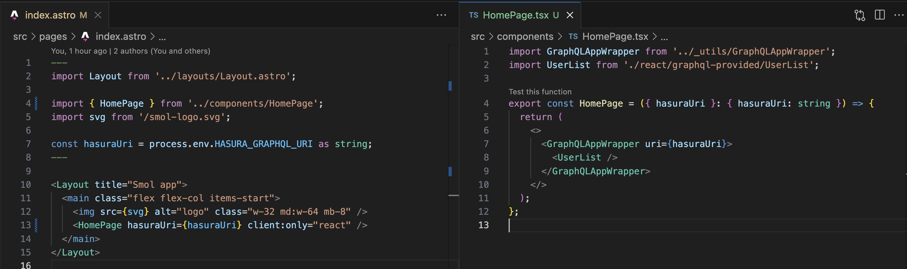

# GraphQL

How to use our Hasura instance in React components:

[This utility component](../src/_utils/GraphQLAppWrapper.tsx) can be wrapped around any React component to provide access to Apollo Client.



We can then use the various hooks available to us to [query](https://www.apollographql.com/docs/react/data/queries/#executing-a-query), [subscribe to](https://www.apollographql.com/docs/react/data/subscriptions#executing-a-subscription) or [mutate](https://www.apollographql.com/docs/react/data/mutations#example) data from our GraphQL API.

Before we do this however, we need some types setup for the queries/mutations/subscriptions that we want to execute.

Start by running `pnpm graphql:generate`. This listens to any updates to `.graphql` files and updates our [GraphQL TypeScript API](../src//graphql-api.ts) with any new types.

To test this out save the following as a file with a `.graphl` extension in [this folder](../src/graphql/):

```graphql
query AllUsers {
  user {
    id
    poe_name
    poe_user_id
    discord_name
  }
}
```

You should see a git diff with some new types generated. Now let's consume this data in a react component!

```tsx
import { useQuery } from '@apollo/client';

import { AllUsersDocument, AllUsersQuery } from '../../graphql-api';

const AllUsers = () => {
  const { data, loading } = useQuery<AllUsersQuery>(AllUsersDocument);

  if (loading) return <Spinner />;

  return <>{JSON.stringify(data)}</>;
};
```
